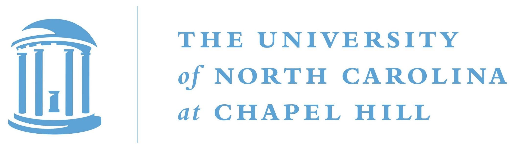

# SCAM Detective

  
 

The SCAM Detective is a toolkit for assessing the potential of chemicals to be putative aggregators and cause false-positive readouts in bioassays. SCAM Detective makes predictions on Quantitative Structure-Interference Relationship (QSIR) models built on two independent datasets generated from High Throughput Screening campaigns against AmpC β-lactamase (PubChem AID [485341](https://pubchem.ncbi.nlm.nih.gov/bioassay/485341)/[485294](https://pubchem.ncbi.nlm.nih.gov/bioassay/485294) and AID [585](https://pubchem.ncbi.nlm.nih.gov/bioassay/585)/[584](https://pubchem.ncbi.nlm.nih.gov/bioassay/584)) and the cysteine protease cruzain (PubChem AID 1476/1478). The models were developed using open-source chemical descriptors based on ECFP6-like Morgan fingerprints with 2048 bits and an atom radius of 3 calculated in RDKit, along with the random forest (RF) algorithm, using Python 3.7. The models were generated applying the best practices for model development and validation widely accepted by the community.

For a web application version of this tool, please visit https://scamdetective.mml.unc.edu/.

# Supported functionality
## Tasks:
* Prediction of aggregation based on QSIR models of beta-lactamase and cruzain.
* Maps of the predicted fragment contribution are generated.

## Data types
* SDF
* SMILES in .csv or .txt.

## Requirements
In order to get started you need:
* Python 3.7 ([Anaconda](https://www.anaconda.com/distribution/) distribution is recommended)
* [RDKit](https://www.rdkit.org/docs/Install.html)
* [scikit-learn](http://scikit-learn.org/)

# Acknowledgements

SCAM Detective is sponsored by the [UNC Eshelman School of Pharmacy](https://pharmacy.unc.edu/) of the [University of North Carolina at Chapel Hill](https://www.unc.edu/).

  
  
   

